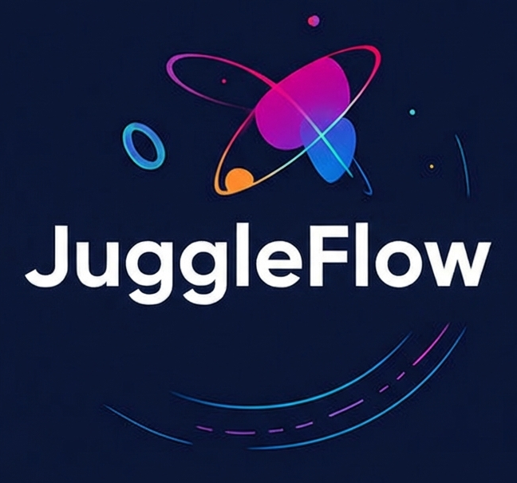
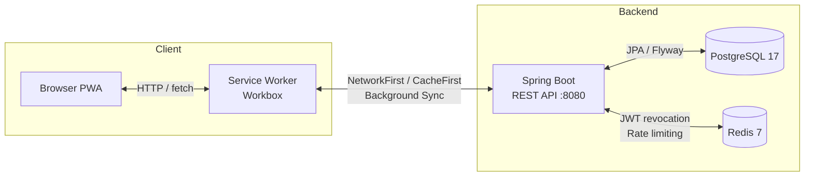

# JuggleFlow

<p align="center">
  
</p>

<p align="center">
  Plateforme pédagogique PWA pour l'apprentissage du jonglage en contexte scolaire et associatif.<br/>
  Parcours progressifs, suivi enseignant en temps réel, gamification et conformité RGPD adaptée aux établissements accueillant des mineurs.<br/>
  S'installe sur mobile et reste entièrement utilisable <strong>hors connexion</strong> pendant les séances en salle.
</p>

<p align="center">
  <a href="https://github.com/votre-org/juggleflow/actions/workflows/ci.yml"></a>
  <a href="https://github.com/votre-org/juggleflow/actions/workflows/codeql.yml"></a>
  <a href="LICENSE"></a>
  
  
  
  
  
  
</p>

---

## Table des matières

- [Fonctionnalités](#fonctionnalités)
- [Architecture & Stack technique](#architecture--stack-technique)
- [Prérequis](#prérequis)
- [Installation](#installation)
- [Configuration](#configuration)
- [Démarrage](#démarrage)
- [Comptes de démonstration](#comptes-de-démonstration)
- [Structure du projet](#structure-du-projet)
- [Tests](#tests)
- [Déploiement](#déploiement)
- [Sécurité](#sécurité)
- [Conformité RGPD](#conformité-rgpd)
- [Contribuer](#contribuer)
- [Licence](#licence)

---

## Fonctionnalités

### Élève

- Onboarding personnalisé selon le niveau initial (débutant → expert)
- Catalogue de figures avec animations générées par [Juggling Lab](https://jugglinglab.org/) (notation siteswap)
- Parcours pédagogiques progressifs assignés par l'enseignant (assignation individuelle prioritaire sur l'assignation de classe)
- Suivi de progression par figure : non commencé / en cours / maîtrisé
- Sessions de pratique chronométrées
- Système de points XP et de rangs (Bronze, Argent, Or) avec badges de progression (maîtrise, séries, paliers)
- Défi du jour commun à tous les élèves d'un établissement
- Favoris, ressources pédagogiques (vidéos, exercices, module théorique Brain)
- **Mode hors-ligne** : synchronisation différée des mises à jour de progression via Background Sync (Workbox)
- **Installation PWA** : icône sur l'écran d'accueil, mode standalone, raccourcis applicatifs

### Enseignant

- Gestion de classes et de groupes colorés (Vert / Orange / Rouge) pour segmenter la progression
- Assignation de parcours à une classe entière ou individuellement par élève
- Tableau de bord : progression moyenne par classe, alertes de blocage par figure
- Fiche individuelle par élève avec historique complet de progression
- Export CSV de la progression par parcours
- Consultation des ressources pédagogiques
- Création de comptes élèves directement depuis l'interface (mot de passe généré côté serveur, affiché une seule fois)

### Administrateur

- Gestion des utilisateurs (création, activation/désactivation, réinitialisation de mot de passe)
- Gestion des classes, groupes et établissements
- Gestion des ressources pédagogiques (upload PDF)
- Tableau de bord statistiques de l'établissement
- Journal d'audit des actions sensibles (création, réinitialisation, désactivation)
- Gestion des licences : plafond de sièges et date d'expiration configurables via l'interface
- **Interface RGPD** : consentements parentaux, exports CSV/PDF, relance, anonymisation

---

## Architecture & Stack technique

| Composant | Technologie | Version |
|-----------|-------------|---------|
| Monorepo | [Nx](https://nx.dev) | 22.6.5 |
| Frontend | React + TypeScript + Vite | 19 / 5.9 / 8 |
| UI | Tailwind CSS | 4 |
| Data-fetching | TanStack Query | v5 |
| Routing | React Router DOM | v6 |
| Formulaires | React Hook Form + Zod | v7 / v4 |
| PWA | vite-plugin-pwa + Workbox | 1.3 |
| Backend | Spring Boot + Java | 3.4.2 / 21 |
| Authentification | JWT (access + refresh httpOnly) + révocation JTI Redis | — |
| Base de données | PostgreSQL + migrations Flyway | 17 / V1→V18 |
| Cache / sécurité | Redis (révocation JWT + rate limiting distribués) | 7 |
| Tests frontend | Vitest + Testing Library | 4.1 |
| Tests backend | JUnit 5 | — |
| Tests E2E | Playwright | 1.52 |
| CI/CD | GitHub Actions | — |
| Conteneurisation | Docker / Podman Compose | — |

### Flux applicatif



**Stratégies de cache Workbox :**

| Route | Stratégie |
|-------|-----------|
| `/api/auth/**` | NetworkOnly |
| `PUT /api/progress/:id` | NetworkOnly (queue offline) |
| `GET /api/tricks`, `/api/learning-paths` | NetworkFirst (TTL 24 h) |
| `/api/juggling-lab/**` | CacheFirst (TTL 7 j) |
| Images | CacheFirst (TTL 30 j) |
| Google Fonts | StaleWhileRevalidate |

---

## Prérequis

| Outil | Version minimale | Lien |
|-------|-----------------|------|
| Node.js | 22 | [nodejs.org](https://nodejs.org) |
| Java (JDK) | 21 | [adoptium.net](https://adoptium.net) |
| PostgreSQL | 17 | [postgresql.org](https://www.postgresql.org) |
| Redis | 7 | [redis.io](https://redis.io) |
| Docker ou Podman | Dernière stable | [docker.com](https://www.docker.com) / [podman.io](https://podman.io) |

> PostgreSQL et Redis peuvent être gérés via Docker/Podman — aucune installation locale n'est requise dans ce cas.

---

## Installation

```bash
# Cloner le dépôt
git clone https://github.com/votre-org/juggleflow.git
cd juggleflow

# Installer les dépendances Node (frontend + outils Nx)
npm ci
```

---

## Configuration

Copier le fichier d'exemple et renseigner les variables :

```bash
cp apps/backend/.env.example apps/backend/.env
```

**Variables obligatoires :**

| Variable | Description | Exemple |
|----------|-------------|---------|
| `POSTGRES_PASSWORD` | Mot de passe PostgreSQL | `change-me` |
| `JWT_SECRET` | Secret JWT (≥ 32 caractères) | `openssl rand -base64 64` |
| `CORS_ALLOWED_ORIGINS` | URL(s) du frontend autorisées | `https://juggleflow.example.com` |

**Variables de sécurité importantes :**

| Variable | Défaut | Description |
|----------|--------|-------------|
| `COOKIE_SECURE` | `false` | Mettre à `true` en production (HTTPS) |
| `APP_TRUSTED_PROXY` | `false` | `true` uniquement derrière un reverse proxy de confiance |
| `APP_JWT_REVOCATION_STORE` | `memory` | `redis` en production multi-instances |
| `APP_RATE_LIMIT_STORE` | `memory` | `redis` en production multi-instances |
| `SWAGGER_ENABLED` | `true` | `false` en production |
| `DEMO_BOOTSTRAP_ENABLED` | `false` | Ne jamais activer en production |

Toutes les variables disponibles sont documentées dans `apps/backend/.env.example`.

> **Sécurité** — Ne jamais versionner le fichier `.env`. Ne jamais utiliser les valeurs par défaut en production.

---

## Démarrage

### Avec Podman ou Docker (recommandé)

Les commandes ci-dessous utilisent `podman compose` ; remplacer par `docker compose` si vous utilisez Docker Desktop.

```bash
# 1. Démarrer PostgreSQL et Redis
podman compose up -d postgres redis

# 2. Démarrer le backend (les migrations Flyway s'exécutent automatiquement au démarrage)
podman compose up backend
```

L'API REST est disponible sur `http://localhost:8080`.  
La documentation Swagger (dev uniquement) est accessible sur `http://localhost:8080/swagger-ui.html`.

### Mode prod-like (image immutable)

Ce mode ne monte pas le code source dans le conteneur et se rapproche d'un déploiement réel.

```bash
export POSTGRES_PASSWORD='change-me'
export JWT_SECRET='change-me-please-generate-a-long-secret-32-chars-minimum'
export CORS_ALLOWED_ORIGINS='http://localhost:4200'

# Podman
podman compose -f compose.prod.yml up -d

# Docker
docker compose -f compose.prod.yml up -d
```

### Frontend

```bash
npx nx serve frontend
```

L'application est disponible sur `http://localhost:4200`.  
Le proxy Vite redirige automatiquement `/api/**` vers `http://localhost:8080`.

> Pour tester la PWA en mode offline, utiliser `npm run frontend:preview:pwa` (build + preview avec Service Worker actif).

### Sans Docker (PostgreSQL local)

```bash
# Créer la base et l'utilisateur PostgreSQL, configurer apps/backend/.env, puis :
cd apps/backend
./mvnw spring-boot:run
```

---

## Comptes de démonstration

> **Attention** — Ces comptes sont réservés au développement et à la soutenance. Ne jamais activer en production.

Pour les créer, définir dans `apps/backend/.env` :

```env
ADMIN_BOOTSTRAP_EMAIL=admin@juggleflow.local
ADMIN_BOOTSTRAP_PASSWORD=<mot-de-passe-complexe>
DEMO_BOOTSTRAP_ENABLED=true
DEMO_BOOTSTRAP_PASSWORD=<mot-de-passe-demo>
```

| Rôle | Email | Mot de passe |
|------|-------|--------------|
| Administrateur | `admin@juggleflow.local` | valeur de `ADMIN_BOOTSTRAP_PASSWORD` |
| Enseignant | `marie.dupont@ecole.fr` | valeur de `DEMO_BOOTSTRAP_PASSWORD` |
| Élève | `lucas.martin@ecole.fr` | valeur de `DEMO_BOOTSTRAP_PASSWORD` |

---

## Structure du projet

```
juggleflow/
├── .github/
│   ├── preview.png                         # Capture d'écran du README
│   └── workflows/
│       ├── ci.yml                          # Lint / tests / build / E2E
│       ├── codeql.yml                      # Analyse statique de sécurité
│       ├── container-scan.yml              # Scan des images Docker
│       ├── dependency-review.yml           # Revue des dépendances (PR)
│       └── secret-scan.yml                 # Détection de secrets exposés
├── apps/
│   ├── frontend/                           # PWA React
│   │   ├── e2e/                            # Tests Playwright
│   │   │   ├── smoke.spec.ts
│   │   │   ├── auth-session.spec.ts
│   │   │   ├── student-journey.spec.ts
│   │   │   ├── teacher-journey.spec.ts
│   │   │   ├── admin-rgpd.spec.ts
│   │   │   ├── role-guard.spec.ts
│   │   │   └── z-rate-limit.spec.ts        # Exécuté en dernier (ordre alpha)
│   │   └── src/
│   │       ├── api/                        # Couche HTTP + wrappers offline
│   │       ├── components/                 # Composants réutilisables
│   │       ├── hooks/                      # Hooks React (réseau, PWA…)
│   │       ├── pages/                      # Pages par rôle (student/ teacher/ admin/)
│   │       └── utils/                      # Logique métier (offline queue, pathProgress…)
│   └── backend/                            # API Spring Boot
│       ├── init/
│       │   └── juggleflow_postgresql_en.sql # Schéma initial de référence
│       └── src/main/
│           ├── java/com/juggleflow/backend/
│           │   ├── bootstrap/              # AdminBootstrapRunner, DemoBootstrapRunner
│           │   ├── config/                 # OpenAPI, ProdSafetyChecks, AuthRegistration
│           │   ├── controller/             # Endpoints REST (auth, admin, progress…)
│           │   ├── dto/                    # Objets de transfert (requêtes/réponses)
│           │   ├── model/                  # Entités JPA
│           │   ├── repository/             # Couche d'accès données (Spring Data)
│           │   ├── security/               # Filtres JWT, rate limiting
│           │   └── service/                # Logique métier
│           └── resources/
│               └── db/migration/           # Migrations Flyway (V1 → V18)
├── docker-compose.yml                      # Stack de développement local
├── compose.prod.yml                        # Stack prod-like (images immutables)
├── nx.json                                 # Configuration Nx
├── package.json                            # Dépendances Node + scripts racine
└── PRODUCTION_CHECKLIST.md                 # Checklist avant mise en production
```

---

## Tests

### Frontend — Vitest

```bash
npx nx test frontend       # Tests unitaires (Vitest 4.1 + Testing Library)
npx nx lint frontend       # Lint ESLint + Prettier
```

### Backend — JUnit 5

```bash
cd apps/backend
./mvnw test                # Tests unitaires et d'intégration
./mvnw clean package       # Build du JAR (tests inclus)
./mvnw clean package -DskipTests  # Build rapide sans tests
```

### E2E — Playwright

**Prérequis :** PostgreSQL + Redis démarrés et API démarrée avec `DEMO_BOOTSTRAP_ENABLED=true`.

```bash
# Démarrer l'infrastructure
podman compose up -d postgres redis
podman compose up backend

# Dans un autre terminal, depuis la racine du monorepo
npx playwright install --with-deps chromium
npm run e2e

# Interface graphique (debug)
npm run e2e:ui
```

**Variables d'environnement E2E :**

| Variable | Défaut | Description |
|----------|--------|-------------|
| `E2E_PASSWORD` | valeur de `DEMO_BOOTSTRAP_PASSWORD` | Mot de passe comptes `@ecole.fr` |
| `E2E_TEACHER_EMAIL` | `marie.dupont@ecole.fr` | Compte enseignant CE1 |
| `E2E_STUDENT_EMAIL` | `lucas.martin@ecole.fr` | Compte élève |
| `E2E_ADMIN_EMAIL` | `admin@juggleflow.local` | Compte administrateur |
| `E2E_ADMIN_PASSWORD` | valeur de `ADMIN_BOOTSTRAP_PASSWORD` | Mot de passe admin |

**Scénarios couverts :**

| Fichier | Scénario |
|---------|----------|
| `smoke.spec.ts` | Chargement de l'application, login, redirect par rôle |
| `auth-session.spec.ts` | Rotation refresh token, expiration, logout |
| `student-journey.spec.ts` | Onboarding, catalogue, progression, badges |
| `teacher-journey.spec.ts` | Tableau de bord, blocage, export CSV, assignation |
| `admin-rgpd.spec.ts` | Consentements, exports, anonymisation |
| `role-guard.spec.ts` | Isolation des routes par rôle |
| `z-rate-limit.spec.ts` | Déclenchement du rate limiting (exécuté en dernier) |

### Pipeline CI — GitHub Actions

Chaque push sur `master` et chaque pull request déclenchent les jobs suivants :

| Job | Déclencheur | Description |
|-----|-------------|-------------|
| `frontend` | push / PR | Lint + Vitest + build Vite |
| `backend` | push / PR | JUnit 5 + build JAR Maven |
| `e2e` | après frontend + backend | Playwright sur stack complète (PostgreSQL 17 + Redis 7 + bootstrap démo) |
| `codeql` | push / PR | Analyse statique Java et TypeScript |
| `dependency-review` | PR uniquement | Détection de dépendances vulnérables introduites |
| `container-scan` | push / PR | Scan de l'image Docker |
| `secret-scan` | push / PR | Détection de secrets dans les commits |

---

## Déploiement

### Variables de production (backend)

| Variable | Valeur recommandée |
|----------|--------------------|
| `JWT_SECRET` | Chaîne aléatoire ≥ 64 caractères (`openssl rand -base64 64`) |
| `COOKIE_SECURE` | `true` (HTTPS obligatoire) |
| `SWAGGER_ENABLED` | `false` |
| `SWAGGER_PUBLIC` | `false` |
| `APP_PUBLIC_REGISTRATION_ENABLED` | `false` |
| `APP_TRUSTED_PROXY` | `true` si derrière un reverse proxy / ingress de confiance |
| `APP_JWT_REVOCATION_STORE` | `redis` |
| `APP_RATE_LIMIT_STORE` | `redis` |
| `CORS_ALLOWED_ORIGINS` | URL de production du frontend uniquement (pas de `*`) |
| `DEMO_BOOTSTRAP_ENABLED` | `false` |
| `ADMIN_BOOTSTRAP_EMAIL` | Laisser vide après la première initialisation |

### Reverse proxy et IP client

Si `APP_TRUSTED_PROXY=true`, le backend utilise la **dernière** entrée de l'en-tête `X-Forwarded-For` pour déterminer l'IP client. Ce comportement est intentionnel : derrière un proxy de confiance qui ajoute sa propre IP en fin de liste, cette valeur ne peut pas être forgée par le client.

S'assurer que le proxy est configuré pour **ajouter** `X-Forwarded-For` (append) et ne pas transmettre sans modification la valeur fournie par le client.

### Build de production (frontend)

```bash
npx nx build frontend
# Fichiers statiques générés dans apps/frontend/dist/
# À servir via nginx, Caddy, ou un CDN.
```

### Healthcheck

L'endpoint `/actuator/health` est exposé pour les sondes Kubernetes (`livenessProbe`, `readinessProbe`) et les healthchecks Docker Compose. Il ne retourne aucune information d'infrastructure.

### Checklist avant mise en production

Voir [`PRODUCTION_CHECKLIST.md`](PRODUCTION_CHECKLIST.md) pour la liste complète des vérifications (secrets, Redis, reverse proxy, RGPD, backups).

---

## Sécurité

### Authentification et sessions

- **JWT httpOnly** : le refresh token est stocké dans un cookie `HttpOnly; Secure; SameSite=Strict`, inaccessible depuis JavaScript.
- **Rotation systématique** : chaque renouvellement invalide le refresh token précédent (rotation par JTI).
- **Révocation JTI** : les tokens invalidés (logout, réinitialisation de mot de passe) sont inscrits en liste noire dans Redis jusqu'à leur expiration naturelle.

### Rate limiting

Le rate limiting est appliqué côté serveur via un filtre Spring Security. En production multi-instances, le store Redis garantit un comptage cohérent entre les répliques.

### Analyse de sécurité continue (CI)

- **CodeQL** : analyse statique de sécurité sur le code Java et TypeScript à chaque push.
- **Dependency Review** : détection de dépendances présentant des CVE connues à chaque pull request.
- **Container Scan** : analyse des vulnérabilités dans l'image Docker du backend.
- **Secret Scan** : détection de secrets (clés API, tokens) dans l'historique Git.

### Fail-fast en profil `prod`

La classe `ProdSafetyChecks` vérifie au démarrage que les options dangereuses (`DEMO_BOOTSTRAP_ENABLED`, `SWAGGER_PUBLIC`, `APP_PUBLIC_REGISTRATION_ENABLED`) sont bien désactivées. Le backend refuse de démarrer si ce n'est pas le cas.

### Signalement de vulnérabilités

Merci de signaler toute vulnérabilité de sécurité via [GitHub Security Advisories](https://github.com/votre-org/juggleflow/security/advisories/new) et non via les issues publiques.

---

## Conformité RGPD

JuggleFlow est conçu pour les établissements scolaires et associatifs accueillant des mineurs :

- **Consentement parental** requis, versionné et horodaté, avec mécanisme de relance configurable
- **Expiration automatique** des consentements (durée configurable, défaut : 1 an scolaire)
- **Droit d'accès** : export des données personnelles d'un élève au format CSV ou PDF depuis l'interface admin
- **Droit à l'effacement** : suppression et anonymisation des données via l'interface admin
- **Journal d'audit** : traçabilité de toutes les actions sensibles (création de compte, réinitialisation de mot de passe, désactivation, exports)
- **Isolation des données** : aucune donnée partagée entre établissements ni transmise à des tiers
- **Licences sièges** : limitation et contrôle du nombre d'utilisateurs actifs par établissement

---

## Contribuer

1. Créer une branche à partir de `master` :
   ```bash
   git checkout -b feat/ma-fonctionnalite
   ```
2. Suivre les conventions [Conventional Commits](https://www.conventionalcommits.org/) (`feat:`, `fix:`, `docs:`, `test:`…)
3. S'assurer que les tests passent localement avant d'ouvrir une PR :
   ```bash
   npx nx test frontend && npx nx lint frontend
   cd apps/backend && ./mvnw test
   ```
4. Ouvrir une pull request avec une description claire : contexte, changements apportés, captures d'écran si pertinent.

La CI vérifie automatiquement lint, tests unitaires, build et tests E2E sur chaque PR.

---

## Licence

Ce projet est distribué sous licence **MIT** — voir [LICENSE](LICENSE) pour les détails.

Les animations de jonglage sont générées par [Juggling Lab](https://jugglinglab.org/), logiciel libre distribué sous licence **GPL**.

---

*JuggleFlow — Projet pédagogique RNCP6 (Concepteur·ice Développeur·ice d'Applications).*
