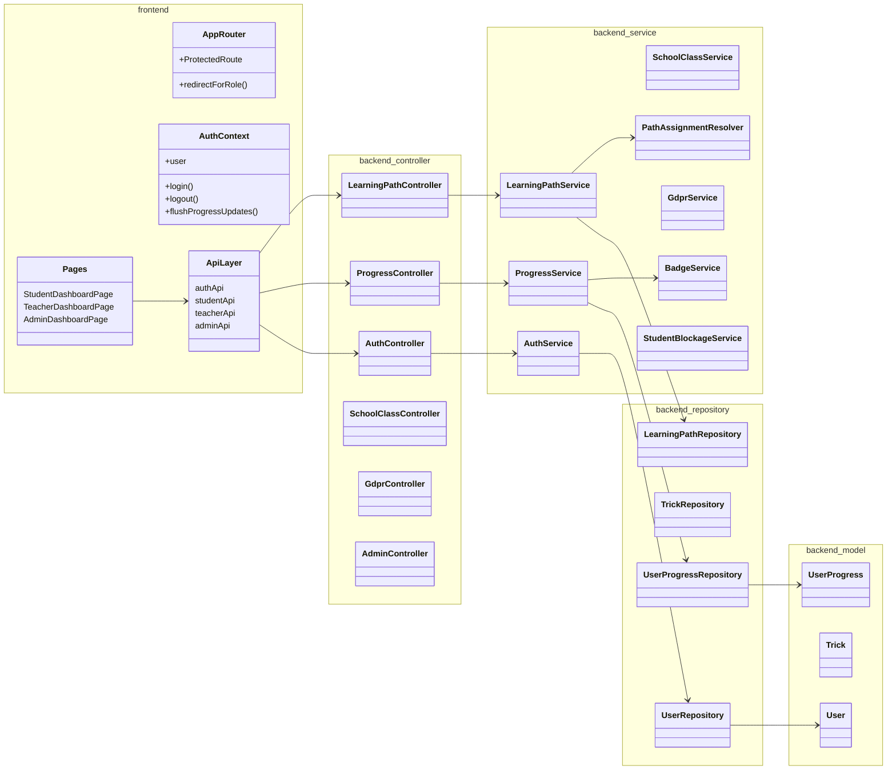

# Diagramme de classes — JuggleFlow

**Date :** 30 juin 2026  
**Périmètre :** couche modèle JPA (`apps/backend/src/main/java/com/juggleflow/backend/model/`) et services associés

---

## 1. Diagramme entités JPA (couche persistence)

```mermaid
classDiagram
    direction TB

    class User {
        <<abstract>>
        +Long id
        +String email
        +String password
        +String firstName
        +String lastName
        +boolean enabled
        +Instant createdAt
        +Instant updatedAt
        +getRole() String*
    }

    class Student {
        +SchoolClass schoolClass
        +String schoolLevel
        +LocalDate birthDate
        +LocalDate enrollmentDate
        +String jugglingLevel
        +Instant onboardingCompletedAt
        +String assignedGroupColor
        +boolean practiceRemindersEnabled
        +boolean darkModeEnabled
        +getRole() ROLE_ELEVE
    }

    class Teacher {
        +String subjectsTaught
        +boolean certified
        +getRole() ROLE_ENSEIGNANT
    }

    class Administrator {
        +String adminRole
        +getRole() ROLE_ADMINISTRATEUR
    }

    class SchoolClass {
        +Long classId
        +String className
        +String schoolLevel
        +Integer schoolYear
        +Integer studentCount
        +Teacher homeroomTeacher
    }

    class Trick {
        +Long trickId
        +String trickName
        +String siteswap
        +String description
        +String jugglingLabAnimationUrl
        +String jugglingLabPattern
        +String learningTips
        +Integer difficultyScore
        +Integer estimatedLearningDuration
        +boolean popular
        +DifficultyLevel level
        +Category category
        +Set~Trick~ prerequisites
    }

    class DifficultyLevel {
        +Long levelId
        +String levelName
        +Integer progressionOrder
    }

    class Category {
        +Long categoryId
        +String categoryName
        +String icon
    }

    class UserProgress {
        +Long progressId
        +User user
        +Trick trick
        +ProgressStatus status
        +Integer masteryPercentage
        +Integer attemptCount
        +Instant startedAt
        +Instant masteredAt
        +Instant lastPractice
    }

    class LearningPath {
        +Long learningPathId
        +String pathName
        +TargetLevel targetLevel
        +boolean active
        +List~LearningPathStep~ steps
    }

    class LearningPathStep {
        +Long stepId
        +Integer stepOrder
        +String instructions
        +Integer minPracticeTime
        +LearningPath learningPath
        +Trick trick
    }

    class ClassLearningPath {
        +Long classLearningPathId
        +LocalDate startDate
        +LocalDate expectedEndDate
        +LearningPath learningPath
        +SchoolClass schoolClass
    }

    class StudentLearningPath {
        +Long studentLearningPathId
        +LocalDate startDate
        +LocalDate expectedEndDate
        +User student
        +LearningPath learningPath
    }

    class Badge {
        +Long badgeId
        +String badgeName
        +String unlockCriteria
        +Integer experiencePoints
        +BadgeType badgeType
    }

    class BadgeType {
        +Long badgeTypeId
        +String typeName
        +String color
    }

    class UserBadge {
        +Long userBadgeId
        +User user
        +Badge badge
        +Instant unlockedAt
        +boolean notified
    }

    class GdprConsent {
        +Long consentId
        +User user
        +ConsentType consentType
        +boolean consentGiven
        +Instant consentAt
        +String policyVersion
        +Instant expiresAt
    }

    class UserStreak {
        +User user
        +Integer currentStreakDays
        +Integer longestStreakDays
        +LocalDate lastPracticeDate
    }

    class PracticeSession {
        +Long id
        +User user
        +Trick trick
        +Instant startedAt
        +Instant endedAt
        +Integer durationSeconds
        +String source
    }

    class DailyChallenge {
        +Long id
        +Integer rotationSlot
        +String title
        +Trick targetTrick
        +boolean active
    }

    class PedagogicalResource {
        +Long resourceId
        +Audience audience
        +ResourceType resourceType
        +String title
        +String resourceUrl
        +boolean active
    }

    class EstablishmentSettings {
        +Long id
        +String establishmentName
        +Integer licenseSeatCap
        +LocalDate licenseExpiresAt
    }

    class UserFavoriteTrick {
        +Long id
        +User user
        +Trick trick
        +Instant createdAt
    }

    class StudentBrainModuleChapter {
        +User user
        +Integer chapterNumber
        +Instant completedAt
    }

    class AdminAuditEvent {
        +Long id
        +Instant occurredAt
        +String actorEmail
        +String action
        +String details
    }

  User <|-- Student
  User <|-- Teacher
  User <|-- Administrator

  Student "0..*" --> "0..1" SchoolClass
  SchoolClass "0..*" --> "0..1" Teacher : homeroomTeacher

  Trick "0..*" --> "1" DifficultyLevel
  Trick "0..*" --> "0..1" Category
  Trick "0..*" --> "0..*" Trick : prerequisites

  UserProgress "0..*" --> "1" User
  UserProgress "0..*" --> "1" Trick

  LearningPath "1" --> "0..*" LearningPathStep
  LearningPathStep "0..*" --> "1" Trick

  ClassLearningPath "0..*" --> "1" LearningPath
  ClassLearningPath "0..*" --> "1" SchoolClass

  StudentLearningPath "0..*" --> "1" User
  StudentLearningPath "0..*" --> "1" LearningPath

  Badge "0..*" --> "1" BadgeType
  UserBadge "0..*" --> "1" User
  UserBadge "0..*" --> "1" Badge

  GdprConsent "0..*" --> "1" User
  UserStreak "0..1" --> "1" User
  PracticeSession "0..*" --> "1" User
  UserFavoriteTrick "0..*" --> "1" User
  UserFavoriteTrick "0..*" --> "1" Trick
  StudentBrainModuleChapter "0..*" --> "1" User
```



**Stratégie d'héritage :** `InheritanceType.JOINED` avec discriminant `user_type` (`User.java`).

---

## 2. Diagramme architecture applicative (couches)



---

## 3. Énumérations métier

| Classe | Énumération | Valeurs |
|--------|-------------|---------|
| `UserProgress` | `ProgressStatus` | NOT_STARTED, IN_PROGRESS, MASTERED |
| `LearningPath` | `TargetLevel` | BEGINNER, INTERMEDIATE, ADVANCED, EXPERT |
| `GdprConsent` | `ConsentType` | DATA_USAGE, COMMUNICATION, COOKIES, PARENTAL_MINOR |
| `GdprConsent` | `ConsentStatus` (calculé) | MISSING, REVOKED, EXPIRED, VALID |
| `PedagogicalResource` | `Audience` | TEACHER, STUDENT |
| `PedagogicalResource` | `ResourceType` | STUDY_PDF, TEACHER_VIDEO, TEACHER_GUIDE, STUDENT_VIDEO, STUDENT_EXERCISE, BRAIN_MODULE |

---

## 4. Services métier principaux

| Service | Responsabilité | Entités manipulées |
|---------|----------------|-------------------|
| `AuthService` | Authentification JWT, refresh, logout | `User` |
| `ProgressService` | CRUD progression, stats, streak | `UserProgress`, `UserStreak` |
| `BadgeService` | Évaluation critères déblocage | `Badge`, `UserBadge` |
| `LearningPathService` | Parcours, assignations, exports CSV | `LearningPath`, `ClassLearningPath`, `StudentLearningPath` |
| `PathAssignmentResolver` | Résolution parcours effectif élève | `StudentLearningPath`, `ClassLearningPath` |
| `SchoolClassService` | Classes, élèves, groupes | `SchoolClass`, `Student` |
| `StudentBlockageService` | Détection blocage (≥3 tentatives) | `UserProgress`, `LearningPathStep` |
| `GdprService` | Consentements, exports, anonymisation | `GdprConsent` |
| `DailyChallengeService` | Rotation défi quotidien | `DailyChallenge` |
| `StudentOnboardingService` | Onboarding niveau | `Student` |
| `TrickFavoriteService` | Favoris catalogue | `UserFavoriteTrick` |
| `BrainModuleProgressService` | Chapitres module cerveau | `StudentBrainModuleChapter` |
| `EstablishmentLicenseService` | Licence singleton | `EstablishmentSettings` |
| `JugglingLabAnimationService` | Proxy animations GIF | — (externe Juggling Lab) |

**Total :** 26 entités JPA, 22 repositories, 31 services, 17 contrôleurs REST.

---

## 5. Fichiers source

```
apps/backend/src/main/java/com/juggleflow/backend/
├── model/          (26 entités)
├── repository/     (22 interfaces)
├── service/        (31 services)
├── controller/     (17 contrôleurs)
├── dto/            (objets transfert API)
├── security/       (SecurityConfig, JwtFilter, RateLimitFilter)
└── exception/      (GlobalExceptionHandler)
```
