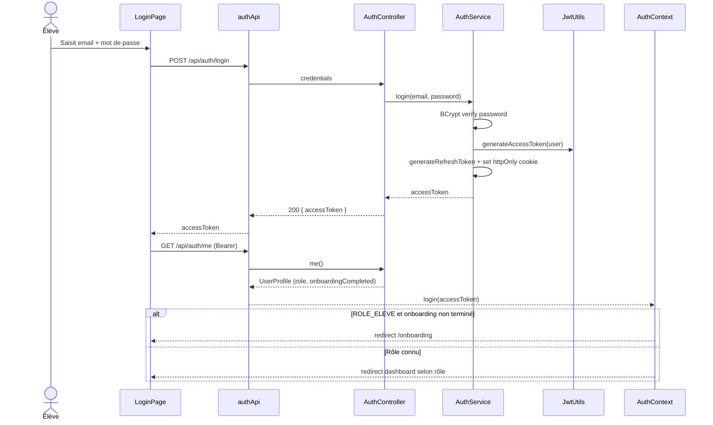
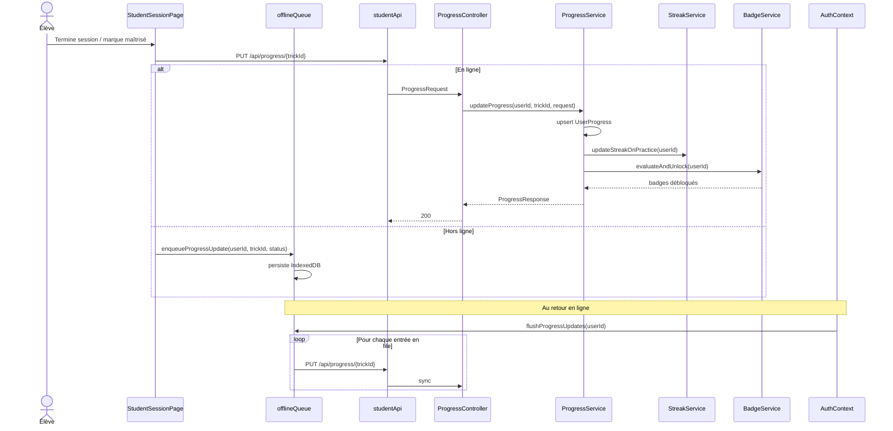
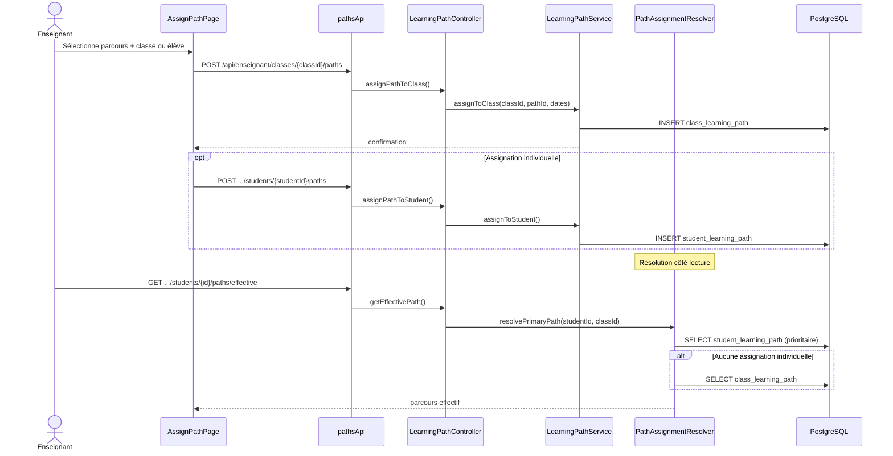
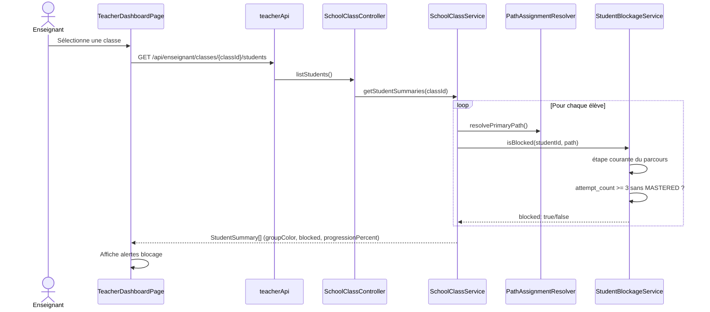
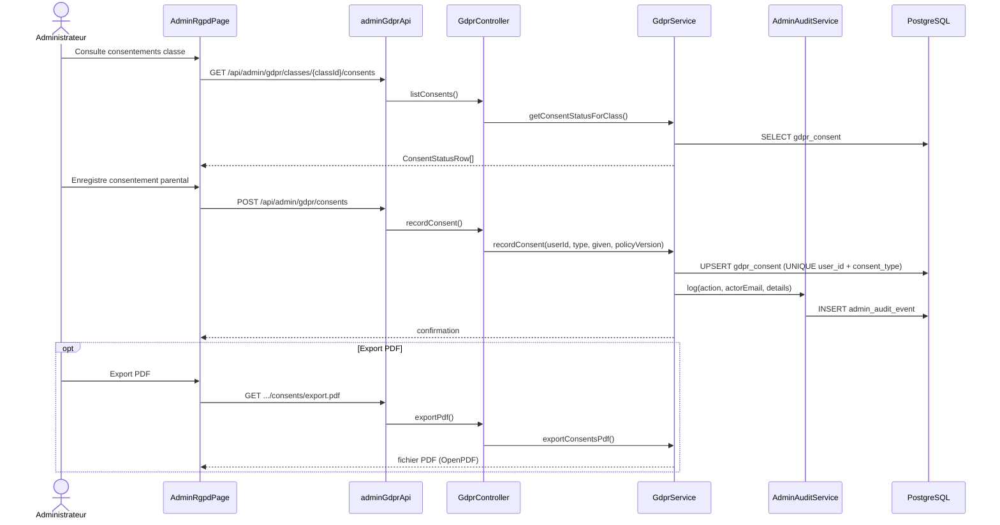
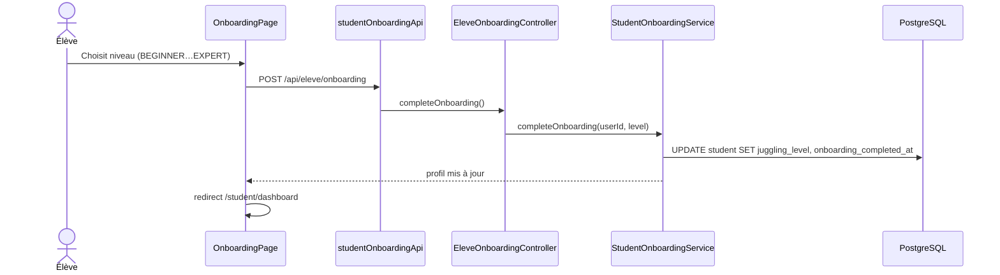
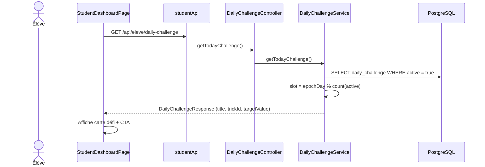

# Diagrammes de séquences — JuggleFlow

**Date :** 30 juin 2026  
**Source :** flux implémentés dans le code frontend et backend

---

## 1. Authentification (connexion + session)

**Fichiers :** `LoginPage.tsx` → `authApi.ts` → `AuthController.java` → `AuthService.java` → `AuthContext.tsx`

**Refresh automatique :** `AuthContext.tsx` intercepte les 401, appelle `POST /api/auth/refresh` (cookie), met à jour l'access token en mémoire.

**Déconnexion :** `POST /api/auth/logout` → révocation JTI (Redis) + suppression cookie refresh.

---

## 2. Mise à jour de progression (avec synchronisation offline)

**Fichiers :** `StudentSessionPage.tsx` → `offlineQueue.ts` → `ProgressController.java` → `ProgressService.java` → `BadgeService.java` → `StreakService.java`

**Note :** la table `practice_session` n'est pas alimentée par ce flux ; le chronomètre reste côté UI.

---

## 3. Assignation de parcours par l'enseignant

**Fichiers :** `AssignPathPage.tsx` → `pathsApi.ts` → `LearningPathController.java` → `LearningPathService.java`

---

## 4. Détection de blocage élève (dashboard enseignant)

**Fichiers :** `TeacherDashboardPage.tsx` → `SchoolClassController.java` → `StudentBlockageService.java`

---

## 5. Consentement RGPD (administrateur)

**Fichiers :** `AdminRgpdPage.tsx` → `adminGdprApi.ts` → `GdprController.java` → `GdprService.java` → `AdminAuditService.java`

---

## 6. Onboarding élève

**Fichiers :** `OnboardingPage.tsx` → `studentOnboardingApi.ts` → `EleveOnboardingController.java` → `StudentOnboardingService.java`

---

## 7. Défi du jour

**Fichiers :** `StudentDashboardPage.tsx` → `DailyChallengeController.java` → `DailyChallengeService.java`

---

## Récapitulatif des flux documentés

| # | Flux | Acteur | Endpoints clés |
|---|------|--------|----------------|
| 1 | Authentification | Tous | `POST /api/auth/login`, `GET /api/auth/me` |
| 2 | Progression offline | Élève | `PUT /api/progress/{trickId}` |
| 3 | Assignation parcours | Enseignant | `POST .../paths`, `GET .../effective` |
| 4 | Détection blocage | Enseignant | `GET .../students` |
| 5 | Consentement RGPD | Admin | `POST /api/admin/gdpr/consents` |
| 6 | Onboarding | Élève | `POST /api/eleve/onboarding` |
| 7 | Défi du jour | Élève | `GET /api/eleve/daily-challenge` |
