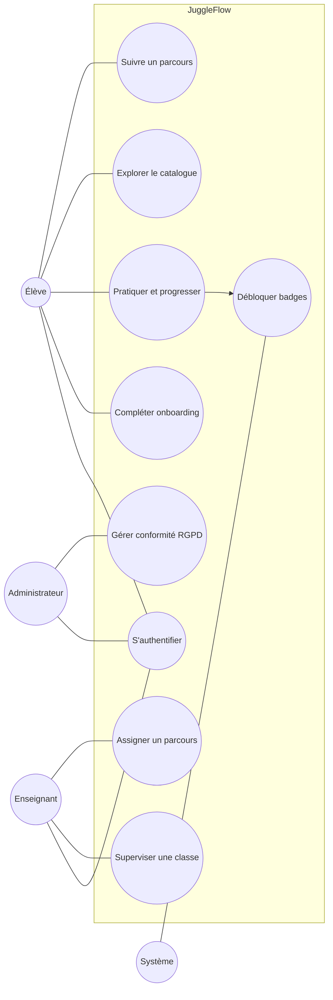

# Diagramme de cas d'utilisation — JuggleFlow

**Date :** 30 juin 2026  
**Acteurs :** dérivés des rôles Spring Security (`ROLE_ELEVE`, `ROLE_ENSEIGNANT`, `ROLE_ADMINISTRATEUR`) et du système automatisé

---

## 1. Vue d'ensemble

```mermaid
flowchart TB
    subgraph acteurs["Acteurs"]
        E((Élève))
        T((Enseignant))
        A((Administrateur))
        S((Système))
    end

    subgraph public["Accès public"]
        UC01[Se connecter]
        UC02[Réinitialiser mot de passe]
    end

    subgraph eleve["Cas d'utilisation Élève"]
        UC10[Compléter l'onboarding]
        UC11[Consulter le dashboard]
        UC12[Parcourir le catalogue de figures]
        UC13[Consulter une figure]
        UC14[Pratiquer une figure]
        UC15[Mettre à jour sa progression]
        UC16[Consulter ses badges]
        UC17[Consulter son parcours assigné]
        UC18[Relever le défi du jour]
        UC19[Gérer ses favoris]
        UC20[Consulter les ressources pédagogiques]
        UC21[Suivre le module cerveau]
        UC22[Configurer ses préférences]
        UC23[Utiliser l'application hors-ligne]
    end

    subgraph enseignant["Cas d'utilisation Enseignant"]
        UC30[Consulter le dashboard classe]
        UC31[Gérer les élèves]
        UC32[Créer un élève]
        UC33[Assigner les groupes couleur]
        UC34[Assigner un parcours]
        UC35[Consulter la fiche élève]
        UC36[Consulter la progression par parcours]
        UC37[Exporter la progression CSV]
        UC38[Consulter les ressources enseignant]
        UC39[Identifier les élèves en blocage]
    end

    subgraph admin["Cas d'utilisation Administrateur"]
        UC50[Consulter les statistiques établissement]
        UC51[Gérer les utilisateurs]
        UC52[Gérer les classes]
        UC53[Gérer la licence]
        UC54[Gérer les ressources pédagogiques]
        UC55[Gérer les consentements RGPD]
        UC56[Exporter les données RGPD]
        UC57[Consulter le journal d'audit]
    end

    subgraph systeme["Cas d'utilisation Système"]
        UC60[Débloquer les badges automatiquement]
        UC61[Calculer le défi du jour]
        UC62[Calculer le groupe couleur automatique]
        UC63[Résoudre le parcours effectif]
        UC64[Synchroniser la progression offline]
        UC65[Anonymiser les données fin d'année]
    end

    E --> UC01
    E --> UC02
    E --> UC10
    E --> UC11
    E --> UC12
    E --> UC13
    E --> UC14
    E --> UC15
    E --> UC16
    E --> UC17
    E --> UC18
    E --> UC19
    E --> UC20
    E --> UC21
    E --> UC22
    E --> UC23

    T --> UC01
    T --> UC30
    T --> UC31
    T --> UC32
    T --> UC33
    T --> UC34
    T --> UC35
    T --> UC36
    T --> UC37
    T --> UC38
    T --> UC39

    A --> UC01
    A --> UC50
    A --> UC51
    A --> UC52
    A --> UC53
    A --> UC54
    A --> UC55
    A --> UC56
    A --> UC57

    UC15 -.-> UC60
    UC15 -.-> UC64
    UC11 -.-> UC61
    UC30 -.-> UC62
    UC30 -.-> UC39
    UC17 -.-> UC63
    UC55 -.-> UC65
```

---

## 2. Détail par acteur

### 2.1 Élève (`ROLE_ELEVE`)

| ID | Cas d'utilisation | Précondition | Endpoint / page |
|----|-------------------|--------------|-----------------|
| UC10 | Compléter l'onboarding | Première connexion, `onboardingCompleted` = false | `OnboardingPage`, `POST /api/eleve/onboarding` |
| UC11 | Consulter le dashboard | Authentifié, onboarding terminé | `StudentDashboardPage` |
| UC12 | Parcourir le catalogue | Authentifié | `CataloguePage`, `GET /api/tricks` |
| UC13 | Consulter une figure | Authentifié | `TrickDetailPage`, `GET /api/tricks/{id}` |
| UC14 | Pratiquer une figure | Figure sélectionnée | `StudentSessionPage` |
| UC15 | Mettre à jour sa progression | Session ou action manuelle | `PUT /api/progress/{trickId}` |
| UC16 | Consulter ses badges | Authentifié | `BadgesPage`, `GET /api/badges` |
| UC17 | Consulter son parcours | Parcours assigné | `StudentLearningPathPage`, `GET /api/eleve/learning-paths` |
| UC18 | Relever le défi du jour | Authentifié | Dashboard, `GET /api/eleve/daily-challenge` |
| UC19 | Gérer ses favoris | Authentifié | Catalogue, `PUT/DELETE /api/eleve/favorites/{trickId}` |
| UC20 | Consulter les ressources | Authentifié | `ResourcesStudentPage`, `GET /api/resources?audience=STUDENT` |
| UC21 | Suivre le module cerveau | Authentifié | Profil → module, `POST /api/eleve/brain-module/chapters/{n}/complete` |
| UC22 | Configurer ses préférences | Authentifié | `StudentProfilePage`, `PATCH /api/eleve/preferences` |
| UC23 | Utiliser hors-ligne | PWA installée, données préchargées | `offlineQueue.ts`, `offlineCatalogueStore` |

### 2.2 Enseignant (`ROLE_ENSEIGNANT`)

| ID | Cas d'utilisation | Précondition | Endpoint / page |
|----|-------------------|--------------|-----------------|
| UC30 | Consulter le dashboard classe | Authentifié, au moins une classe | `TeacherDashboardPage` |
| UC31 | Gérer les élèves | Classe sélectionnée | `StudentListPage`, `GET .../students` |
| UC32 | Créer un élève | Classe sélectionnée | `POST .../classes/{classId}/students` |
| UC33 | Assigner les groupes | Élève existant | `GroupManagementPage`, `PATCH .../group` |
| UC34 | Assigner un parcours | Parcours et cible définis | `AssignPathPage`, `POST .../paths` |
| UC35 | Consulter la fiche élève | Élève existant | `StudentDetailPage`, `GET .../students/{id}/context` |
| UC36 | Consulter progression parcours | Parcours assigné | `TeacherPathDetailPage`, `GET .../progress` |
| UC37 | Exporter progression CSV | Parcours assigné | `GET .../progress/export` |
| UC38 | Consulter ressources | Authentifié | `ResourcesTeacherPage`, `GET /api/resources?audience=TEACHER` |
| UC39 | Identifier élèves en blocage | Dashboard chargé | `StudentBlockageService` via `GET .../students` |

### 2.3 Administrateur (`ROLE_ADMINISTRATEUR`)

| ID | Cas d'utilisation | Précondition | Endpoint / page |
|----|-------------------|--------------|-----------------|
| UC50 | Consulter statistiques | Authentifié admin | `AdminDashboardPage`, `GET /api/admin/stats` |
| UC51 | Gérer les utilisateurs | Authentifié admin | `AdminUsersPage`, CRUD `/api/admin/users` |
| UC52 | Gérer les classes | Authentifié admin | `AdminClassesPage`, `/api/admin/classes` |
| UC53 | Gérer la licence | Authentifié admin | `AdminLicenseSection`, `PATCH /api/admin/license` |
| UC54 | Gérer les ressources | Authentifié admin | `AdminResourcesPage`, `POST /api/admin/resources/{id}/file` |
| UC55 | Gérer consentements RGPD | Authentifié admin | `AdminRgpdPage`, `/api/admin/gdpr/consents` |
| UC56 | Exporter données RGPD | Consentements existants | `GET .../consents/export`, `.../export.pdf` |
| UC57 | Consulter journal d'audit | Authentifié admin | `AdminAuditPage`, `GET /api/admin/audit-events` |

### 2.4 Système (automatisé)

| ID | Cas d'utilisation | Déclencheur | Service |
|----|-------------------|-------------|---------|
| UC60 | Débloquer badges | `PUT /api/progress/{trickId}` | `BadgeService.evaluateAndUnlock()` |
| UC61 | Calculer défi du jour | `GET /api/eleve/daily-challenge` | `DailyChallengeService` — `epochDay % count(active)` |
| UC62 | Calculer groupe couleur | `assigned_group_color` NULL | `StudentSummaryResponse` — seuils 70 % / 40 % |
| UC63 | Résoudre parcours effectif | Lecture parcours élève | `PathAssignmentResolver` — individuel > classe |
| UC64 | Synchroniser progression offline | Retour en ligne | `AuthContext` → `flushProgressUpdates()` |
| UC65 | Anonymiser fin d'année | Planification | `GdprService.scheduleYearEndDeletion()` |

---

## 3. Diagramme UML (notation use case)

---

## 4. Matrice acteur × cas d'utilisation

| Cas d'utilisation | Élève | Enseignant | Admin | Système |
|-------------------|:-----:|:----------:|:-----:|:-------:|
| S'authentifier | ✓ | ✓ | ✓ | |
| Onboarding | ✓ | | | |
| Catalogue / figures | ✓ | | | |
| Session pratique | ✓ | | | |
| Progression / badges | ✓ | | | ✓ |
| Parcours assigné | ✓ | ✓ | | ✓ |
| Dashboard classe | | ✓ | | ✓ |
| Gestion élèves / groupes | | ✓ | | |
| Export CSV | | ✓ | ✓ | |
| Gestion utilisateurs / classes | | | ✓ | |
| RGPD / audit | | | ✓ | ✓ |
| Ressources pédagogiques | ✓ | ✓ | ✓ | |
| Mode offline / PWA | ✓ | | | ✓ |

---

## 5. Cas d'utilisation exclus (non implémentés)

Les éléments suivants **ne figurent pas** dans le code et ne sont donc pas documentés :

- Inscription publique désactivable (`APP_PUBLIC_REGISTRATION_ENABLED`) — pas un parcours élève standard
- Écriture en base des sessions chronométrées (`practice_session`) — table existante, pas de service d'écriture production
- Persistance des rangs XP — calcul frontend uniquement
