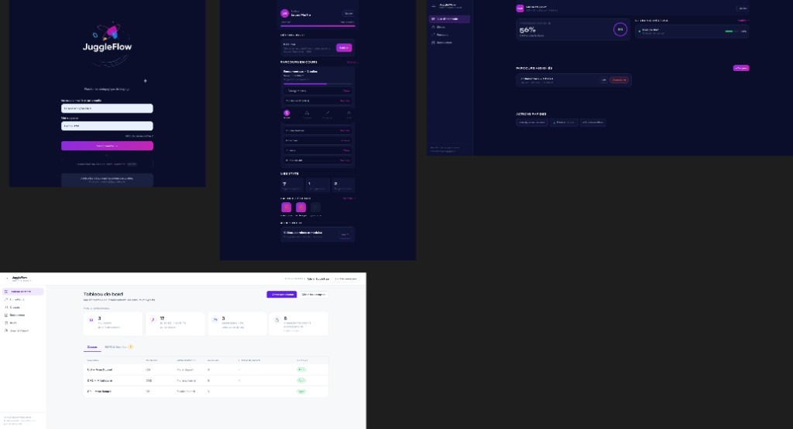

# 03 — Périmètre fonctionnel (état actuel du code)

**Sources :** README, `AppRouter.tsx`, contrôleurs backend, `docs/analyse-projet/05-diagramme-cas-utilisation.md`, PDF MVP (pour écarts uniquement).

---

## 1. Acteurs et rôles

| Rôle Spring Security | Préfixe UI | Préfixes API principaux |
|----------------------|------------|-------------------------|
| `ROLE_ELEVE` | `/student/*`, `/onboarding` | `/api/eleve/*`, `/api/progress`, `/api/tricks`, `/api/badges`, `/api/resources`, `/api/learning-paths` |
| `ROLE_ENSEIGNANT` | `/teacher/*` | `/api/enseignant/*`, `/api/classes/**` (gate teacher/admin) |
| `ROLE_ADMINISTRATEUR` | `/admin/*` | `/api/admin/**` |

Héritage utilisateurs JOINED : `User` → `Student` / `Teacher` / `Administrator` (`model/`).

---

## 2. Fonctionnalités élève (implémentées)

| Fonctionnalité | Preuve |
|----------------|--------|
| Connexion / refresh / logout | `AuthController`, `AuthContext.tsx` |
| Mot de passe oublié | `ForgotPasswordPage`, `POST /api/auth/forgot-password` |
| Onboarding niveau (`BEGINNER`…`EXPERT`) | `OnboardingPage`, `EleveOnboardingController` |
| Dashboard (XP UI, défi du jour, parcours, stats, badges récents) | `StudentDashboardPage` |
| Catalogue (recherche, niveau, favoris, populaires, pagination) | `CataloguePage`, `TrickController` |
| Fiche figure + animation Juggling Lab | `TrickDetailPage`, `JugglingLabController` |
| Session chronométrée + MAJ progression | `StudentSessionPage`, `PUT /api/progress/{trickId}` |
| Progression / statistiques / streak | `ProgressPage`, `ProgressController`, `StreakService` |
| Badges (API + présentation UI) | `BadgesPage`, `BadgeController`, `BadgeService` |
| Parcours assignés | `StudentLearningPathPage`, `LearningPathController` |
| Favoris | `EleveFavoriteController` |
| Ressources + module cerveau (chapitres séquentiels) | `ResourcesStudentPage`, `EleveBrainModuleController` |
| Préférences (rappels, thème) | `ElevePreferencesController`, profil élève |
| PWA install + cache offline + file de sync progression | `vite.config.mts`, `offlineQueue.ts`, `idb.ts` |

Routes élève : `/student/dashboard`, `/catalogue`, `/trick/:id`, `/session/:id`, `/progression`, `/badges`, `/profil`, `/resources`, `/parcours`, `/parcours/:pathId`.

---

## 3. Fonctionnalités enseignant (implémentées)

| Fonctionnalité | Preuve |
|----------------|--------|
| Dashboard classe (progression, groupes, blocages, parcours) | `TeacherDashboardPage` |
| Liste / recherche élèves, ajout compte existant, création élève | `StudentListPage`, `SchoolClassController` |
| Groupes VERT / ORANGE / ROUGE | `GroupManagementPage`, `assigned_group_color` |
| Fiche élève + parcours effectif | `StudentDetailPage`, `TeacherStudentController` |
| Assignation parcours classe ou individuelle | `AssignPathPage`, `LearningPathService` |
| Détail progression parcours + export CSV | `TeacherPathDetailPage` |
| Ressources enseignant | `ResourcesTeacherPage` |

Navigation déclarée (`teacherNav.ts`) : Vue d’ensemble · Élèves · Parcours · Ressources.  
La page Groupes existe (`/teacher/groupes`) mais n’est pas une entrée dédiée du menu principal (accès depuis dashboard / élèves).

---

## 4. Fonctionnalités administrateur (implémentées)

| Fonctionnalité | Preuve |
|----------------|--------|
| Dashboard établissement / KPI | `AdminDashboardPage`, `GET /api/admin/stats` |
| Utilisateurs : création, enable/disable, reset password | `AdminUsersPage`, `AdminController` |
| Classes CRUD + affectation enseignant | `AdminClassesPage` |
| Licence (plafond sièges, expiration) | `EstablishmentLicenseService`, `PATCH /api/admin/license` |
| Upload PDF ressources | `AdminResourcesPage`, `AdminPedagogicalResourceController` |
| RGPD : consentements, révocation, relances, exports CSV/PDF | `AdminRgpdPage`, `GdprController` |
| Journal d’audit | `AdminAuditPage`, `AdminAuditService` |

**Non présent dans l’UI admin constatée :** édition générique complète d’un utilisateur (hors enable/reset) et suppression utilisateur — le libellé « CRUD utilisateurs » des maquettes est donc trop large.

---

## 5. Cas d’utilisation (synthèse)

Le diagramme détaillé (Mermaid) est dans `docs/analyse-projet/05-diagramme-cas-utilisation.md`. Synthèse :

| Acteur | CU principaux |
|--------|---------------|
| Public | Se connecter, réinitialiser mot de passe |
| Élève | Onboarding, catalogue, pratique, progression, badges, parcours, défi, favoris, ressources, module cerveau, préférences, offline |
| Enseignant | Dashboard, élèves, groupes, parcours, export CSV, ressources, détection blocages |
| Admin | Stats, users, classes, licence, ressources, RGPD, audit |
| Système | Déblocage badges, défi du jour, groupe couleur auto, parcours effectif, sync offline, anonymisation fin d’année |

---

## 6. Tableau d’écarts : PDF MVP ↔ code actuel

Le PDF (page 8) annonce un MVP restreint. Le code actuel est **plus large**.

| Élément PDF MVP | Annonce PDF | État code actuel |
|-----------------|-------------|------------------|
| Parcours élève | 1 parcours « Débuter avec 2 balles » (8 exercices) | Plusieurs parcours seedés (migrations V10, V22…) + assignation classe/élève |
| Tutoriels | 8 tutoriels vidéo (1/exercice, angle fixe) | Animations Juggling Lab + ressources (vidéos/exercices/PDF) — pas limité à 8 vidéos « angle fixe » |
| Validation | Bouton « J’ai réussi » | Statuts `IN_PROGRESS` / `MASTERED` via session / progression |
| Progression | Barre % + exercices complétés | Stats, parcours, streak, badges |
| Enseignant | Vue classe, filtres basiques, export CSV | + groupes couleur, blocages, assignation parcours, fiche élève, création élève |
| Admin | Créer/supprimer comptes, gérer classes | + licence, RGPD, audit, ressources PDF ; suppression user **non** vue dans l’UI |
| Auth sociale | (wireframe « Continuer avec Google ») | **Non implémenté** ; bouton ENT « Bientôt » sur login |
| Inscription libre | Lien « S’inscrire » (wireframe) | `POST /api/auth/register` existe mais **désactivé en production** ; flux nominal = admin / enseignant crée les comptes |

---

## 7. Wireframes fournis vs UI réelle

| Écran wireframe | Correspondance code |
|-----------------|---------------------|
| Login sombre JuggleFlow | `LoginPage.tsx` (sans Google OAuth actif) |
| Dashboard élève mobile | `StudentDashboardPage` + bottom nav |
| Dashboard desktop sombre | Layouts élève / enseignant (sidebar à partir de 1024 px pour teacher) |
| Admin clair | `AdminLayout` / thème `.jf-admin` |

Écarts détaillés maquettes ↔ code : documentés aussi dans `docs/analyse-projet/01-maquettes.md` et confirmés (filtre catégorie catalogue absent, menu Groupes enseignant, etc.).

---

## 8. Fonctionnalités système automatisées

| Automatisme | Implémentation |
|-------------|----------------|
| Badges | `BadgeService.evaluateAndUnlock` après MAJ progression |
| Streak | `StreakService` sur pratique via progress |
| Défi du jour | `epochDay % count(active)` — `DailyChallengeService` |
| Groupe couleur auto | ≥70 % VERT, ≥40 % ORANGE, sinon ROUGE si pas de forçage manuel |
| Parcours effectif | Individuel prioritaire sur classe — `PathAssignmentResolver` |
| Anonymisation fin d’année | Planifiée 30 juin 02:00 — services `gdpr/` |
| Bootstrap démo / admin | `DemoBootstrapRunner`, `AdminBootstrapRunner` (désactivés en prod) |
