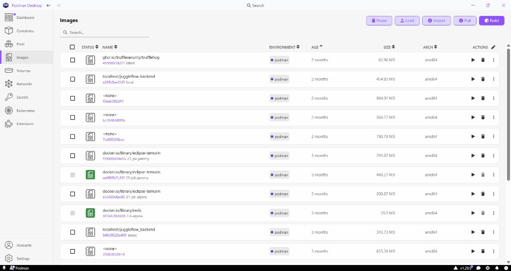
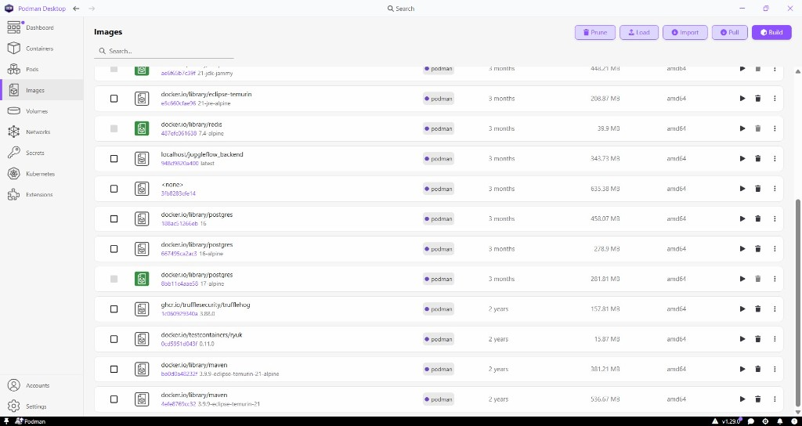
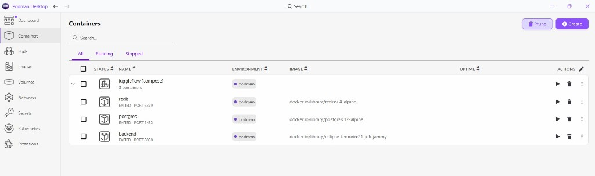
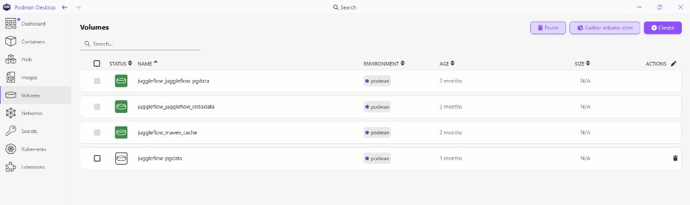

# 09 — Environnement de travail et conteneurisation Podman

**Compétence RNCP principalement couverte :** CP1 — Installer et configurer son environnement de travail.  
**Sources :** README, `docker-compose.yml`, captures Podman Desktop fournies.

---

## 1. Choix Podman

Le README présente **Podman** (ou Docker) comme moyen recommandé pour PostgreSQL, Redis et l’API. Les commandes documentées utilisent `podman compose` en premier.

Avantages retenus pour le dossier (liés à l’usage réel, sans sur-vendre) :

- environnement **reproductible** (mêmes images que la CI / la prod-like) ;
- isolation des services ;
- volumes nommés pour la persistance ;
- démonstration visuelle via **Podman Desktop**.

---

## 2. Stack Compose de développement

Fichier : `docker-compose.yml`.

| Service | Image | Port | Rôle |
|---------|-------|------|------|
| `postgres` | `postgres:17-alpine` | 5432 | BDD |
| `redis` | `redis:7.4-alpine` | 6379 | Révocation JWT / rate limit |
| `backend` | `eclipse-temurin:21-jdk-jammy` | 8080 | API via `./mvnw spring-boot:run` |

Volumes :

- `juggleflow_pgdata`
- `juggleflow_redisdata`
- `maven_cache` (dépendances Maven)

Le **frontend** tourne hors Compose : `npx nx serve frontend` → `:4200`.

Commandes README :

```bash
podman compose up -d postgres redis
podman compose up backend
```

---

## 3. Preuve — Images Podman Desktop

### 3.1 Images runtime / build



Éléments visibles sur la capture (à décrire à l’oral) :

- image(s) `localhost/juggleflow-backend` ;
- `eclipse-temurin` JDK/JRE 21 ;
- `redis:7.4-alpine` ;
- outil `trufflehog` (scan de secrets — aussi en CI).



Éléments visibles :

- `postgres` (tags 16 / 16-alpine / 17-alpine selon historique local) ;
- `maven` 3.9.9 eclipse-temurin-21 ;
- `testcontainers/ryuk` (lifecycle Testcontainers) ;
- `trufflehog`.

**Note méthodologique :** la présence d’images Postgres 16 en local coexiste avec Compose en **17** et les tests Testcontainers documentés en **16** (`application-test.properties`) — écart d’environnement de test vs runtime Compose, à assumer factuellement.

---

## 4. Preuve — Containers compose `juggleflow`



Groupe Compose `juggleflow` :

| Conteneur | Port | Image |
|-----------|------|-------|
| `redis` | 6379 | `redis:7.4-alpine` |
| `postgres` | 5432 | `postgres:17-alpine` |
| `backend` | 8080 | `eclipse-temurin:21-jdk-jammy` |

Sur la capture fournie, les conteneurs apparaissent en état **EXITED** (arrêtés au moment du screenshot) — cela prouve l’existence de la stack, pas qu’elle tournait à l’instant T.

---

## 5. Preuve — Volumes



| Volume | Usage |
|--------|-------|
| `juggleflow_juggleflow_pgdata` (ou équivalent `juggleflow_pgdata`) | Données PostgreSQL |
| `juggleflow_juggleflow_redisdata` | Persistance Redis AOF |
| `juggleflow_maven_cache` | Cache `~/.m2` pour builds accélérés |
| `juggleflow-pgdata` (ancien / dangling éventuel) | Volume historique non forcément attaché |

---

## 6. Outillage développeur associé

| Outil | Usage dans le projet |
|-------|----------------------|
| Node.js 22+ / npm | Frontend Nx |
| Java 21 / Maven Wrapper | Backend |
| Podman Desktop | Supervision images/containers/volumes |
| GitHub Actions | CI distante |
| Playwright / Vitest / JUnit | Tests |
| TruffleHog | Scan secrets (image locale + workflow) |

---

## 7. Mode prod-like (même famille d’outils)

`compose.prod.yml` :

- build `apps/backend/Dockerfile` → image `juggleflow-backend` ;
- pas de montage source ;
- secrets obligatoires ;
- profil Spring `prod` ;
- healthcheck `/actuator/health`.

```bash
podman compose -f compose.prod.yml up -d
```

---

## 8. Lien avec Kubernetes

Podman/Compose = **environnement de travail et démo locale**.  
Les manifests `k8s/` prolongent la même architecture (Postgres, Redis, backend) vers un cluster — voir [11-deploiement-devops.md](./11-deploiement-devops.md). Ce n’est pas un substitut aux preuves Podman pour CP1.
