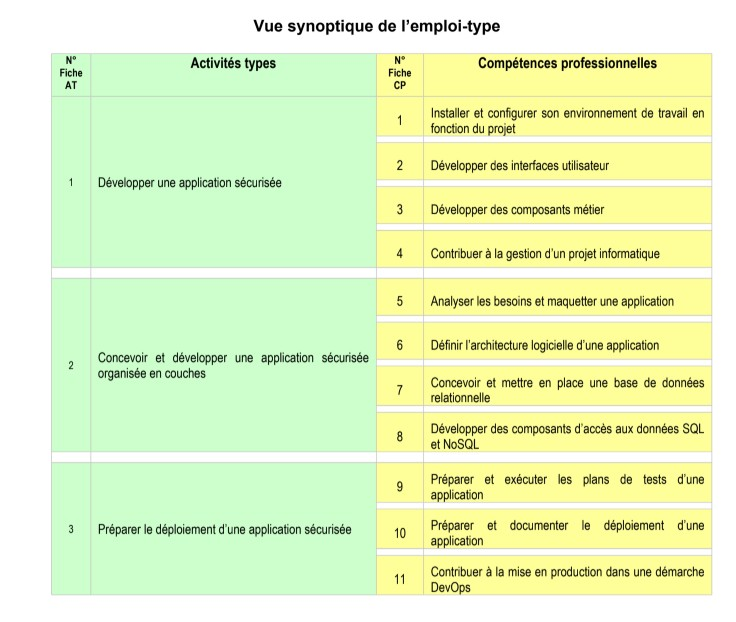

# 13 — Annexes : glossaire et couverture CP1→CP11

---

## A. Glossaire

| Terme | Définition dans ce projet |
|-------|---------------------------|
| PWA | Progressive Web App installable (`vite-plugin-pwa`) |
| Siteswap | Notation des figures de jonglage utilisée avec Juggling Lab |
| JWT | JSON Web Token (access + refresh) |
| JTI | Identifiant unique de jeton, utilisé pour la révocation |
| Flyway | Outil de migrations SQL versionnées |
| RBAC | Contrôle d’accès basé sur les rôles Spring Security |
| Podman | Moteur de conteneurs utilisé pour la stack locale |
| Compose | Orchestration multi-conteneurs (`podman compose`) |
| Workbox | Bibliothèque de service worker (cache) générée via le plugin Vite |
| Testcontainers | Conteneurs éphémères pour tests d’intégration |

---

## B. Inventaire des preuves

| ID | Preuve | Emplacement |
|----|--------|-------------|
| P01 | README projet | `/README.md` |
| P02 | Compose dev | `/docker-compose.yml` |
| P03 | Compose prod-like | `/compose.prod.yml` |
| P04 | Manifests K8s | `/k8s/` |
| P05 | CI | `/.github/workflows/ci.yml` |
| P06 | Scans sécurité | `codeql.yml`, `secret-scan.yml`, `container-scan.yml`, `dependency-review.yml` |
| P07 | Analyse conception | `/docs/analyse-projet/` |
| P08 | Stratégie tests | `/docs/RNCP6-TESTS.md` |
| P09 | Checklist prod | `/PRODUCTION_CHECKLIST.md` |
| P10 | Screenshots sécurité | `/docs/screenshots/security/` |
| P11 | Captures Podman | `/docs/dossier-projet/captures/podman-*.png` |
| P12 | Wireframes UI | `/docs/dossier-projet/captures/wireframes-ui.png` |
| P13 | PDF produit | `JuggleFlow-Apprendre-et-Evoluer-par-le-Jonglage.pdf` |
| P14 | Code frontend | `/apps/frontend/` |
| P15 | Code backend | `/apps/backend/` |

---

## C. Couverture des compétences professionnelles

### AT1 — Développer une application sécurisée

#### CP1 — Installer et configurer son environnement de travail

| Preuve | Référence dossier |
|--------|-------------------|
| Prérequis Node 22, Java 21, Podman/Docker, Postgres, Redis | README ; §09 |
| `podman compose up` Postgres/Redis/backend | §09 ; P02 ; captures containers |
| Volumes pgdata / redisdata / maven_cache | captures volumes |
| Images Temurin, Maven, Postgres, Redis, TruffleHog, Ryuk | captures images |
| Variables `.env` / `.env.example` | README configuration |

#### CP2 — Développer des interfaces utilisateur

| Preuve | Référence |
|--------|-----------|
| Interfaces élève / enseignant / admin | §03, §06 ; P14 |
| PWA manifeste, install, offline UI | §06 |
| Thèmes sombre / clair / admin | `index.css` |
| Wireframes | P12 ; §03 |
| Maquettes fil de fer routes réelles | P07 `01-maquettes.md` |

#### CP3 — Développer des composants métier

| Preuve | Référence |
|--------|-----------|
| Services progression, parcours, badges, blocage, défi, licence | §07 |
| 17 contrôleurs REST | §07 |
| Règles PathAssignmentResolver, StudentBlockageService | §04, §08 |
| Bootstrap démo pour scénarios métier | §07 |

#### CP4 — Contribuer à la gestion d’un projet informatique

| Preuve | Référence |
|--------|-----------|
| Monorepo Nx (frontend + backend) | §05 |
| README, docs analyse, checklist prod | P01, P07, P09 |
| CI GitHub Actions | P05 ; §10–11 |
| Issues/PR process | `[À COMPLÉTER]` si journal de bord personnel |

---

### AT2 — Concevoir et développer une application sécurisée organisée en couches

#### CP5 — Analyser les besoins et maquetter une application

| Preuve | Référence |
|--------|-----------|
| Personas PDF | §02 ; P13 |
| Défis enseignants / socle commun | §01 |
| Cas d’utilisation | P07 `05-…` ; §03–04 |
| Maquettes / wireframes | §04 ; P12 |

#### CP6 — Définir l’architecture logicielle d’une application

| Preuve | Référence |
|--------|-----------|
| Architecture en couches front/back | §05 |
| Séparation controller/service/repository/security | §05, §07 |
| PWA + API + Postgres + Redis | §05 |
| Diagrammes classes / séquences | P07 |

#### CP7 — Concevoir et mettre en place une base de données relationnelle

| Preuve | Référence |
|--------|-----------|
| MCD / MLD | P07 `02-mcd-mld.md` ; §08 |
| Flyway V1–V23 | §08 |
| PostgreSQL 17 Compose + volume | §09 |
| Contraintes unicité, héritage JOINED | §08 |

#### CP8 — Développer des composants d’accès aux données SQL et NoSQL

| Preuve | Référence |
|--------|-----------|
| Repositories Spring Data JPA (SQL) | §08 |
| Requêtes / anonymisation SQL | `PostgresStudentAnonymizationRepository` |
| Redis (store technique JTI + rate limit) | §07–08 — **pas de BDD métier NoSQL** |
| Accès offline navigateur (IDB) — complément client | §06 |

---

### AT3 — Préparer le déploiement d’une application sécurisée

#### CP9 — Préparer et exécuter les plans de tests d’une application

| Preuve | Référence |
|--------|-----------|
| Document `RNCP6-TESTS.md` | P08 ; §10 |
| ~27 classes de tests backend | §10 |
| Vitest + Playwright E2E | §10 |
| Tests sécurité Redis / cookies / CORS / RGPD | §10 |
| CI exécute la pyramide | P05 |

#### CP10 — Préparer et documenter le déploiement d’une application

| Preuve | Référence |
|--------|-----------|
| Compose prod-like + Dockerfile | §11 ; P03 |
| `PRODUCTION_CHECKLIST.md` | P09 |
| `k8s/README.md` + manifests | §11 ; P04 |
| README procédures Podman | P01 ; §09 |

#### CP11 — Contribuer à la mise en production dans une démarche DevOps

| Preuve | Référence |
|--------|-----------|
| CI lint/test/build/E2E | §10–11 |
| CodeQL, TruffleHog, Trivy, dependency-review | §10 |
| Healthchecks Compose / probes K8s | §11 |
| Backend K8s 2 réplicas + Redis stores | `30-backend.yaml` |
| Absence de CD automatique — assumée | §11, §12 |

---

## D. Matrice rapide AT × documents

| CP | Documents dossier |
|----|-------------------|
| CP1 | 00, 05, 09 |
| CP2 | 03, 04, 06 |
| CP3 | 03, 07 |
| CP4 | 05, 10, 11, README |
| CP5 | 01, 02, 04 |
| CP6 | 04, 05 |
| CP7 | 04, 08 |
| CP8 | 08 |
| CP9 | 10 |
| CP10 | 09, 11 |
| CP11 | 10, 11 |

---

## E. Extraíts de code suggérés (à coller en annexe PDF)

1. `SecurityConfig.java` — antMatchers / headers  
2. `JwtUtils.java` — access/refresh + révocation  
3. `RateLimitFilter.java` — quota auth  
4. `ProdSafetyChecks.java` — fail-fast prod  
5. `PathAssignmentResolver.java` — priorité parcours  
6. `BadgeService.java` — critères de déblocage  
7. `offlineQueue.ts` — sync progression  
8. `vite.config.mts` — bloc `VitePWA`  
9. `docker-compose.yml` — services  
10. `V1__init_schema.sql` — extrait `users` / `user_progress`  
11. `AppRouter.tsx` — gardes de rôles  
12. Extrait `ci.yml` — job E2E  

---

## F. Journal des sources utilisées pour cette base

- Inspection code août 2026 (frontend, backend, compose, k8s, workflows)  
- `docs/analyse-projet/*` (30 juin 2026)  
- `docs/RNCP6-TESTS.md`  
- PDF produit JuggleFlow (8 pages)  
- Captures Podman Desktop + wireframes + vue synoptique RNCP fournies par le candidat  

**Rien n’a été inventé.** Les trous sont explicitement marqués `[À COMPLÉTER / NON VÉRIFIÉ]`.
